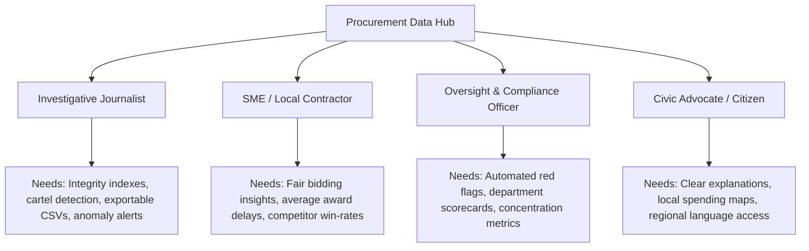
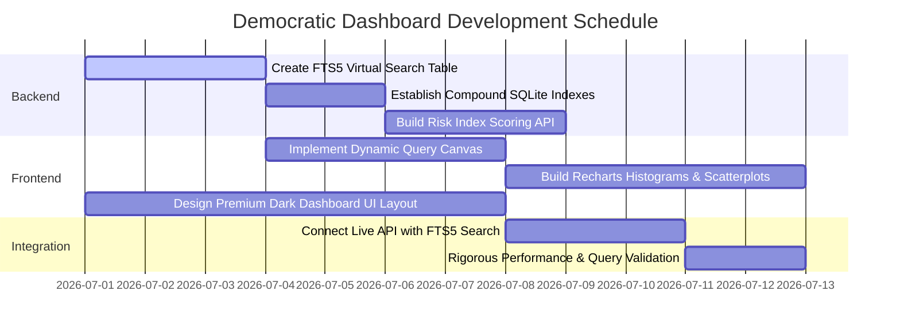

# Architectural Blueprint: Democratizing Procurement Data
## From Dashboard to Civic Investigative Utility

This document outlines the strategic vision, feature specifications, and architectural design to transform the CPPP (Central Public Procurement Portal) Award of Contract (AoC) database into a **truly democratic, granular, and highly utilitarian public watchdog tool**. 

Rather than presenting static, high-level summaries that obfuscate systemic inefficiencies, this blueprint details how to expose raw and aggregated data granularly, enabling citizens, investigative journalists, small business owners, and oversight bodies to audit public spending effectively.

---

## 1. Core Philosophy: The Democratic Civic Utility

Public procurement accounts for a massive share of public expenditure. When procurement data is locked behind complex interfaces or aggregated into generic totals, democracy loses oversight. A democratic dashboard must serve four key personas:



---

## 2. Advanced Feature Specifications & Mathematical Formulations

To truly "milk" the database (consisting of tables like `aoc_clean`, `org_summary`, and `vendor_summary`), we must build analytical layers directly on top of our granular data points.

### A. Dynamic Integrity & Risk Scoring Index (IRI)
Instead of simply showing that a tender has a "red flag," we will assign a composite **Integrity Risk Index (IRI)** to every department and vendor. 

$$\text{IRI} = (w_1 \cdot \text{Single Bid Rate}) + (w_2 \cdot \text{Rush Job Rate}) + (w_3 \cdot \text{Normalized Award Delay})$$

Where:
*   **Single Bid Rate**: Percentage of contracts awarded with `bids_received = 1`. This is a classic indicator of tailored specifications or collusive bidding.
*   **Rush Job Rate**: Percentage of contracts with `bid_window_days < 7`. A short window prevents qualified competitors from participating, suggesting a pre-selected vendor.
*   **Normalized Award Delay**: `award_delay_days` divided by a department or category benchmark (e.g., standard 90 days), capped at 1.0. Excessive delay suggests negotiation friction or manual interference.
*   **Weights ($w_n$)**: Configurable in the UI (e.g., 0.4 for Single Bid, 0.4 for Rush Jobs, 0.2 for Award Delay).

#### UI Implementation:
*   **Risk Heatmap**: A scatterplot comparing departments by their total spending (X-axis) vs. their IRI score (Y-axis).
*   **Risk Profile Card**: When clicking a vendor or department, display a gauge chart showing their IRI ranking against the national average.

---

### B. Cartel & Market Concentration Detector
Small businesses fail to compete because a few giant vendors capture specific departments. We can measure this mathematically to alert anti-corruption bodies:

1.  **Herfindahl-Hirschman Index (HHI)**:
    For any given department (organization), we calculate the sum of the squares of the market shares of all winning vendors:
    $$\text{HHI} = \sum_{i=1}^{n} (s_i)^2$$
    *Where $s_i$ is the percentage share of total contract value won by vendor $i$ in that department.*
    *   **HHI < 1,500**: Highly competitive marketplace.
    *   **1,500 < HHI < 2,500**: Moderately concentrated.
    *   **HHI > 2,500**: Highly concentrated (monopoly/oligopoly).
2.  **Vendor Captivity Index**:
    Identify vendors who receive $>80\%$ of their revenue from a single government department, or departments that award $>60\%$ of their contract value to a single vendor.
3.  **The "Single-Bid Specialist" Flag**:
    Highlight vendors who win frequently *only* when there is a single bid received. If a vendor has a 90% win rate under single-bid conditions but a 5% win rate in multi-bid conditions, this indicates systemic capture.

---

### C. Granular Search & SQL-Query Builder for Citizens
Democratic access means not restricting users to a single search input. We will build a **"Civic Query Canvas"** (no SQL knowledge required, but generates optimized queries under the hood):

```
+----------------------------------------------------------------------------+
|  Find contracts where:                                                     |
|  [ Department ] [ equals / starts with ] [ Central Public Works Dept     ] |
|  [ Bids Received ] [ is less than or equal to ] [ 1                      ] |
|  [ Contract Value ] [ is greater than ] [ 10 Crores                      ] |
|  [ Bidding Window ] [ is less than ] [ 5 days                            ] |
+----------------------------------------------------------------------------+
| [Button: RUN CIVIC AUDIT]                                                  |
+----------------------------------------------------------------------------+
```

*   **Semantic Tokenizer**: Break down search terms into tags (e.g., identifying "road construction", "medical supply", "solar power" across variations in title casing and spelling).
*   **Location Mapping**: Cross-reference the department name/title to map expenditures to states and union territories.

---

### D. Macro to Micro "Drill-Down" Flow
A user should be able to navigate from a trillion-rupee national metric down to a single municipal contract in 4 clicks:

```
[Level 1: Macro KPIs & Spending Trends]
           │
           ▼ (Click on "Ministry of Road Transport")
[Level 2: Department scorecard & Vendor Leaderboard]
           │
           ▼ (Click on "Larsen & Toubro Ltd" under NHAI)
[Level 3: Filtered Tender List of L&T contracts inside NHAI]
           │
           ▼ (Click on specific Tender ID "2026_NHAI_930219")
[Level 4: Granular Tender Detail Page with Red-Flag Analysis & Timelines]
```

---

## 3. Dynamic Infographics & Visualization Suite

To make the data visually compelling and highly analytical, we recommend implementing the following interactive visual materials using React and Recharts/D3.js:

### 1. Bids-Received Distribution Histogram
Instead of just showing the average bids received, display a frequency histogram. 
*   **What it reveals**: A normal distribution would peak around 3–5 bids. A high spike at 1 bid visually proves to the user that competition is being systematically suppressed.
*   **Interactive element**: Clicking on the "1 Bid" bar instantly filters the tender list below to show those specific single-bid contracts.

### 2. Money Flow Sankey Diagram
A flowing diagram showing how funds migrate from the central budget down to departments and finally to top vendors.
*   **What it reveals**: Shows "captured paths" where massive capital flows through single nodes.
*   **Interactive element**: Hovering over a stream highlights the total value and share percentage.

### 3. Bid Window vs. Award Delay Scatterplot
Place tenders on a coordinate grid:
*   **X-Axis**: Bid Window (Days) - Left is faster/rusher.
*   **Y-Axis**: Award Delay (Days) - Top is slower.
*   **What it reveals**: Tenders in the top-left quadrant (published for only 2 days, but delayed by 6 months before awarding) represent extreme anomalies.
*   **Interactive element**: Box-select or zoom into the anomalous quadrant to extract list data.

### 4. "March Madness" / Fiscal Rushes Timeline
A calendar heatmap showing when tenders are published and awarded.
*   **What it reveals**: Pre-budget-close spending spikes (often occurring in March in India), showing how quality control decreases when departments rush to exhaust budgets.

---

## 4. Technical Architecture & Database Optimization Plan

Querying a database of multiple gigabytes (e.g., `aoc_clean` with millions of rows) on SQLite requires strict indexing and aggregation strategies to maintain a sub-second response time.

### A. Database Schema References
We will optimize queries against these specific tables:
1.  **`aoc_clean`**: The core repository of clean tender entries.
2.  **`org_summary`**: Pre-aggregated metrics for organizations.
3.  **`vendor_summary`**: Pre-aggregated metrics for vendors.
4.  **`monthly_summary`**: Time-series aggregation.

### B. Compound Indexing Strategy
To support dynamic multi-column filtering without table scans, we must establish the following indexes in SQLite:

```sql
-- For fast pagination and general search sorted by date
CREATE INDEX IF NOT EXISTS idx_aoc_date_val ON aoc_clean(contract_date DESC, contract_value);

-- For Red-Flag API filtering (combines flags with date index)
CREATE INDEX IF NOT EXISTS idx_aoc_red_flags ON aoc_clean(bids_received, bid_window_days, award_delay_days, contract_date DESC);

-- For vendor-department captivity queries
CREATE INDEX IF NOT EXISTS idx_aoc_vendor_org ON aoc_clean(vendor_name, org_name, contract_value DESC);
```

### C. SQLite FTS5 (Full-Text Search) Integration
Searching millions of text titles with `LIKE %query%` is incredibly slow and locks the database. We will build an FTS5 virtual table for instant search:

```sql
-- Create virtual table
CREATE VIRTUAL TABLE IF NOT EXISTS aoc_search_idx USING fts5(
  internal_id,
  tender_id,
  title,
  org_name,
  vendor_name,
  tokenize='porter unicode61'
);

-- Populate search index (run as part of pipeline build)
INSERT INTO aoc_search_idx(internal_id, tender_id, title, org_name, vendor_name)
SELECT internal_id, tender_id, title, org_name, vendor_name FROM aoc_clean;
```
Now, queries like searching for "solar power" execute in **< 5ms** instead of **> 2000ms**:
```sql
SELECT c.* FROM aoc_clean c 
JOIN aoc_search_idx s ON c.internal_id = s.internal_id 
WHERE aoc_search_idx MATCH 'solar AND power' 
ORDER BY c.contract_date DESC LIMIT 20;
```

---

## 5. Premium UI/UX Design System: "Watchdog Dark"

To wow users and provide a premium "financial-terminal" look, we propose a tailored styling system using CSS custom properties.

### Color Palette & Visual Philosophy
*   **Theme**: Dark Mode optimized for high contrast data legibility (similar to Bloomberg, TradingView, or Linear).
*   **Primary (Background)**: `#0B0F19` (Deep Obsidian Blue)
*   **Secondary (Card Base)**: `#161E2E` (Steel Grey Blue)
*   **Border/Muted**: `#243249` (Deep Slate Border)
*   **Accent / Information**: `#3B82F6` (Electric Blue)
*   **Risk/Warning (High IRI)**: `#EF4444` (Vibrant Crimson Red)
*   **Competitiveness / Healthy**: `#10B981` (Bright Emerald Green)
*   **Warning/Medium Risk**: `#F59E0B` (Amber Yellow)

### Key UI Features
1.  **Dual Language Toggle (EN/HI)**: Smooth font shifting. Using the `Inter` font for English and `Outfit` or `Noto Sans Devanagari` for Hindi to ensure readability at small sizes.
2.  **Glossary Tooltips**: Every column header (e.g. "Bid Window") has an interactive info-tooltip translating the procurement concept into simple language (English/Hindi).
3.  **Visual Micro-animations**:
    *   Hovering over database rows triggers a subtle lateral translation and a glow effect.
    *   KPI cards scale gently and display an active pulse animation if critical flags exceed a high threshold.
    *   Loading states use shimmering skeleton frames mimicking the shape of the charts.

---

## 6. Implementation Action Plan



### Next Steps for Execution:
1.  **Run DB Indexing**: Execute the SQL commands to establish indices on the active `dashboard.db`.
2.  **Build FTS5 virtual table**: Create the text search mechanism.
3.  **Upgrade endpoints**: Rewrite `search/route.js` to utilize FTS5 and `red-flags/route.js` to accept multi-parameters.
4.  **Rewrite Frontend page**: Re-architect `dashboard-ui/src/app/page.js` to structure tabs around:
    *   **Dashboard (KPIs & Trends)**
    *   **Civic Auditor (Granular search & filter builder)**
    *   **Corruption Watch (Red flags, Risk Heatmap, Cartel Detector)**
    *   **Department Comparison Scorecard**
    *   **Competitor Insights (Vendor profiles)**
