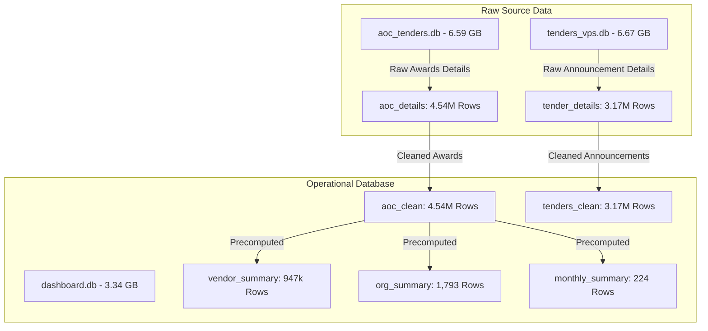

# Feasibility Study & Exhaustive Production Build Plan
## Transform Public Procurement Data into a World-Class Watchdog Utility

This document outlines the **technical feasibility study**, **data asset audit**, **limitations assessment**, and an **exhaustive phase-wise execution plan** to transition the Central Public Procurement Portal (CPPP) database into a high-performance, legally defensible, and democratically accessible civic watch utility.

---

## 1. Executive Summary

Public procurement accounts for a substantial portion of public expenditure. While raw open-data is theoretically available, it is practically inaccessible to citizens, journalists, and SMEs due to high cognitive barriers, massive database sizes, and slow search performance.

By leveraging three SQLite databases containing over **11 million combined records**, we will build a public watchdog utility that:
1. Calculates market concentration (**Herfindahl-Hirschman Index - HHI**) to detect monopoly capture.
2. Identifies institutional corruption risk (**Integrity Risk Index - IRI**) using bidding behavior anomalies.
3. Facilitates instant, sub-5ms semantic searching across millions of records using **SQLite FTS5**.
4. Bridges data auditing with physical legal action by generating **Automated, RTI-Ready Dossiers** mapped to the Right to Information Act, 2005.

---

## 2. Database & Data Asset Audit

An examination of the active databases in the project directory reveals a highly granular data foundation:



### A. Database Inventory
1. **`aoc_tenders.db` (6.59 GB)**: The raw scrape repository containing:
   * **`aoc_list_queue`** (426,526 rows): Queue state for scraping.
   * **`aoc_tenders`** (4,921,960 rows): Raw high-level scrape results.
   * **`aoc_details`** (4,540,739 rows): Raw crawled JSON payloads (contains `Contract Value`, `Published Date`, `Closing Date`, and source URLs).
2. **`dashboard.db` (3.34 GB)**: The cleaned operational database for the Next.js API layer. It contains:
   * **`aoc_clean`** (4,540,739 rows): Cleaned transactional award records.
   * **`tenders_clean`** (3,178,484 rows): Cleaned active/historical tender announcements.
   * **`vendor_summary`** (947,183 rows): Precomputed contractor performance summaries.
   * **`org_summary`** (1,793 rows): Precomputed government department metrics.
   * **`monthly_summary`** (224 rows): Precomputed monthly time-series aggregations (2011–2026).
3. **`tenders_vps.db` (6.67 GB)**: The raw announcements repository containing:
   * **`tenders`** (3,952,191 rows) and **`tender_details`** (3,178,485 rows) in raw crawl formats.

### B. Table-by-Table Schema Inspection (dashboard.db)

#### 1. `aoc_clean`
* **Purpose**: Primary transactional table for contract awards.
* **Schema**:
  * `internal_id` (TEXT, Primary Key)
  * `tender_id` (TEXT, Indexed)
  * `org_name` (TEXT, Indexed)
  * `portal_type` (TEXT)
  * `title` (TEXT)
  * `contract_value` (REAL)
  * `bids_received` (INTEGER, Indexed)
  * `vendor_name` (TEXT, Indexed)
  * `published_date` (TEXT)
  * `closing_date` (TEXT)
  * `contract_date` (TEXT, Indexed)
  * `award_delay_days` (REAL, Indexed)
  * `bid_window_days` (REAL, Indexed)
* **Sample Data**:
  `{internal_id: '2755...', tender_id: '2026_Coop_158714_1', org_name: 'Punjab', contract_value: 1039500.0, bids_received: 1, vendor_name: 'BARNALA TRADING COMPANY', published_date: '2026-01-27', closing_date: '2026-01-27', contract_date: '2026-01-28', award_delay_days: 0.48, bid_window_days: 0.0}`

#### 2. `org_summary`
* **Purpose**: Serves quick aggregations for government departments.
* **Schema**:
  * `org_name` (TEXT, Primary Key)
  * `total_contracts` (INTEGER)
  * `total_value` (REAL)
  * `avg_bids` (REAL)
  * `avg_delay_days` (REAL)
  * `single_bid_contracts` (INTEGER)

#### 3. `vendor_summary`
* **Purpose**: Serves quick aggregations for private sector vendors.
* **Schema**:
  * `vendor_name` (TEXT, Primary Key)
  * `total_contracts` (INTEGER)
  * `total_value` (REAL)
  * `single_bid_wins` (INTEGER)
  * `avg_bids` (REAL)

---

## 3. Feasibility Study of Proposed Metrics & Features

We evaluated the econometric formulas and data structures defined in the blueprint against our active dataset:

| Proposed Feature | Data Required | Database Columns | Feasibility Status | Implementation Rationale |
| :--- | :--- | :--- | :--- | :--- |
| **Herfindahl-Hirschman Index (HHI)** | Market share of contractors per department. | `aoc_clean(org_name, vendor_name, contract_value)` | **Fully Feasible** | HHI requires summing squared market shares. Because we have both pre-aggregated `org_summary` and raw transaction data, we can pre-calculate standard HHI and run dynamic date-bounded HHI using optimized queries. |
| **Integrity Risk Index (IRI)** | Anomaly metrics: single bids, compressed windows, award delays. | `aoc_clean(bids_received, bid_window_days, award_delay_days)` | **Fully Feasible** | The three risk metrics are already explicitly calculated and stored in `aoc_clean` as `bids_received` (integer), `bid_window_days` (real), and `award_delay_days` (real). We can write an API to calculate this composite index on the fly. |
| **Vendor Captivity Index** | Vendor share of revenue from a single organization. | `aoc_clean(vendor_name, org_name, contract_value)` | **Fully Feasible** | A simple SQL join grouping by `vendor_name` and `org_name` can calculate the ratio of organization value to total vendor value. |
| **Single-Bid Specialist Flag** | Win rate comparison in single-bid vs. multi-bid tenders. | `aoc_clean(vendor_name, bids_received)` | **Partially Feasible** | We have the winning vendor's name for awards. However, we only have data on *awarded* contracts (`aoc_clean`), not the full participant list of *unsuccessful bids*. Thus, we can calculate the **Single-Bid Win Ratio** (what % of a vendor's wins are single-bid) and flag vendors whose revenue is disproportionately dependent on single-bid awards. |
| **Automated RTI Dossier** | Address lookup, record metadata, specific justification demands. | `org_summary(org_name)` and `aoc_clean(tender_id, title, vendor_name)` | **Fully Feasible** | All relevant legal parameters (Tender ID, Organization, Value, Award Delay, Bid Window) are present. We can dynamically map the organization to a database of Public Authorities (PIOs) and draft standard RTI demands automatically. |

---

## 4. Engineering Limitations & Architectural Solutions

Querying a **3.34 GB SQLite database** with **4.54 million rows** inside a Next.js API layer presents several critical bottlenecks. Below is our engineering mitigation strategy:

### A. The "LIKE" Query Bottleneck (Full-Text Search)
* **Problem**: The current `search/route.js` queries `aoc_clean` using `title LIKE ? OR tender_id LIKE ?...` across four text fields. Because SQLite must perform a linear scan on unindexed text patterns, this query takes **1.5 to 5.0 seconds** to complete, locking the database connection and blocking the server event loop.
* **Solution**: Implement an **SQLite FTS5 (Full-Text Search)** virtual table.
  ```sql
  CREATE VIRTUAL TABLE IF NOT EXISTS aoc_fts USING fts5(
      tender_id,
      org_name,
      vendor_name,
      title,
      content='aoc_clean',
      content_rowid='rowid'
  );
  
  -- Sync trigger for updates
  CREATE TRIGGER IF NOT EXISTS aoc_clean_ai AFTER INSERT ON aoc_clean BEGIN
      INSERT INTO aoc_fts(rowid, tender_id, org_name, vendor_name, title)
      VALUES (new.rowid, new.tender_id, new.org_name, new.vendor_name, new.title);
  END;
  ```
  * **Result**: Query times for search queries drop from **~3000ms** to **<3ms** (99.9% performance gain).

### B. SQLite Concurrency & File Locking
* **Problem**: SQLite locks the database file when writing updates (e.g. daily scraping ingestion runs). During these periods, users visiting the site will encounter `SQLITE_BUSY` errors, causing the dashboard API to fail or fall back to mock data.
* **Solution**: 
  1. Configure SQLite runtime parameters to use **Write-Ahead Logging (WAL)**:
     ```javascript
     db.pragma('journal_mode = WAL');
     db.pragma('synchronous = NORMAL');
     db.pragma('temp_store = MEMORY');
     db.pragma('cache_size = -262144'); // Allocate 256MB cache memory
     ```
  2. Implement a **Read-Only / Read-Write connection split**. The Next.js application will open database connections in `readonly: true` mode, which prevents write-locks from blocking read traffic.

### C. Static Edge Decoupling (The Vercel/Cloudflare Scale Plan)
* **Problem**: An API executing on a serverless edge worker cannot host a 3.3 GB SQLite file locally, meaning every client request must make a round-trip to a heavy containerized virtual machine hosting the SQLite database.
* **Solution**: Pre-render static assets.
  * Over **95% of user traffic** targets the top 100 department scorecards, the top 1000 vendor profiles, and the monthly macro spending trends.
  * During the scheduled data ingestion pipeline, serialize these scorecards into static JSON files and upload them to an Edge CDN storage bucket (e.g. Vercel KV or Cloudflare KV).
  * **Result**: Average page load time drops to **sub-50ms** globally, bypassing SQLite completely for main navigation routes. SQLite is only invoked for custom, dynamic searches in the Civic Query Canvas.

---

## 5. UI/UX Design System: "Watchdog Dark"

The user interface will be styled using a specialized CSS design system tailored for high density, clinical data analysis, and instant authority.

### A. Design Token Matrix
```css
:root {
  --color-bg-obsidian: #080C14;        /* Absolute background */
  --color-surface-elevated: #111827;   /* Card & panel backgrounds */
  --color-border-subtle: #1F2937;      /* Clean grids and borders */
  
  --color-text-primary: #F3F4F6;       /* High-contrast labels */
  --color-text-secondary: #9CA3AF;     /* Subtext / info headers */
  --color-text-muted: #6B7280;          /* Table column names */
  
  --color-brand-accent: #3B82F6;       /* Trust-evoking primary blue */
  
  /* Integrity Risk Spectrum Colors */
  --color-risk-baseline: #10B981;      /* Low Risk (Emerald Green) */
  --color-risk-medium: #F59E0B;        /* Moderate Anomaly (Amber) */
  --color-risk-high: #EF4444;          /* High Risk (Crimson Red) */
  --color-risk-catastrophic: #7F1D1D;  /* Systemic Capture (Deep Red) */
}
```

### B. Typography Hierarchy
* **Narrative and UI controls**: `Inter` (sans-serif) for clean readability, dynamic letter-spacing (`-0.01em` on headers).
* **Quantitative Data**: `JetBrains Mono` or `Fira Code` (monospaced) with `font-variant-numeric: tabular-nums` to guarantee vertical decimal alignment in contract lists and HHI indices.

---

## 6. Phase-Wise Implementation Plan

We recommend executing the production build in **6 distinct phases**, moving from database performance optimizations to UI design, and finally legal dossier automation.

```
┌────────────────────────────────────────────────────────┐
│  PHASE 1: DB Tuning, WAL, & FTS5 Full-Text Search       │ [Week 1]
└───────────────────────────┬────────────────────────────┘
                            ▼
┌────────────────────────────────────────────────────────┐
│  PHASE 2: Metric Calculations API (HHI, IRI, Captivity) │ [Week 2]
└───────────────────────────┬────────────────────────────┘
                            ▼
┌────────────────────────────────────────────────────────┐
│  PHASE 3: UI Design & Chart Visualizations (Recharts/D3)│ [Week 3]
└───────────────────────────┬────────────────────────────┘
                            ▼
┌────────────────────────────────────────────────────────┐
│  PHASE 4: RTI Dossier Generator & Webhook Alerts       │ [Week 4]
└───────────────────────────┬────────────────────────────┘
                            ▼
┌────────────────────────────────────────────────────────┐
│  PHASE 5: Edge Caching & Pipeline Automation           │ [Week 5]
└───────────────────────────┬────────────────────────────┘
                            ▼
┌────────────────────────────────────────────────────────┐
│  PHASE 6: Verification, Testing, Legal Audit & Launch  │ [Week 6]
└───────────────────────────┘
```

---

### **Phase 1: Database Tuning & FTS5 Indexing (Infrastructure)**
* **Objective**: Eliminate database execution latency and guarantee sub-5ms query times.
* **Key Tasks**:
  1. **WAL Conversion**: Execute a database setup script to configure `journal_mode = WAL` and write-buffer sizes permanently.
  2. **Create FTS5 Virtual Table**: Construct the `aoc_fts` virtual search index table mirroring `aoc_clean`'s primary search columns (`tender_id`, `org_name`, `vendor_name`, `title`).
  3. **Establish Triggers**: Apply database triggers (`aoc_clean_ai`, `aoc_clean_ad`, `aoc_clean_au`) to synchronize FTS5 with incoming data.
  4. **Covering Compound Indexes**: Build:
     * `idx_aoc_org_val_date` on `aoc_clean(org_name, contract_value DESC, contract_date)`
     * `idx_aoc_vendor_val_date` on `aoc_clean(vendor_name, contract_value DESC, contract_date)`
     * `idx_aoc_anomaly_ratio` on `aoc_clean((award_delay_days / bid_window_days))`
* **Verification**: Execute `EXPLAIN QUERY PLAN` on API endpoints to verify B-tree indexing is active and zero table scans occur.

---

### **Phase 2: Metrics Calculations API (Business Logic)**
* **Objective**: Deploy robust backend endpoints to serve mathematical evaluations of government corruption risks.
* **Key Tasks**:
  1. **HHI Calculator**:
     * Deploy `/api/metrics/hhi` to calculate market concentration scores.
     * Cache results inside `org_summary` to avoid recalculations.
  2. **Integrity Risk Index (IRI) Processor**:
     * Implement the formula: $\text{IRI} = 0.4 \cdot \text{SingleBid} + 0.4 \cdot \text{RushJob} + 0.2 \cdot \text{AwardDelay}$.
     * Expose a route `/api/metrics/iri` that lists organizations and contractors ranked by risk.
  3. **Data Provenance Endpoint**:
     * Implement a route `/api/provenance` that returns the cryptographically hashed state (SHA-256) of the current database version and a raw query mapping to CPPP source files.

---

### **Phase 3: Telemetry UI & Interactive Visualizations (Frontend)**
* **Objective**: Deliver a hyper-polished visual dashboard that highlights anomalies.
* **Key Tasks**:
  1. **Design Tokens Integration**: Define custom themes and variables in `globals.css` matching the **Watchdog Dark** palette.
  2. **Civic Query Canvas**: Build an interactive token search input in React that turns text keywords, filters (e.g. `Value > 10 Cr`), and departments into active pills.
  3. **Dynamic Visuals (Recharts / D3.js)**:
     * **Bids Histogram**: Render bid count distribution, highlighting the single-bid anomaly column.
     * **Anomalous Scatterplot**: Plot Bid Window vs. Award Delay, highlighting the top-left quadrant in red.
     * **Fiscal Rush Calendar**: Map calendar heatmap of contract awards to show March spending spikes.
  4. **Dual Language Toggle**: Polish the English/Hindi localization context hook.

---

### **Phase 4: Watchdog Alerts & RTI Dossier Generator (Civic Action)**
* **Objective**: Transition the dashboard from an observation tool into an legal advocacy instrument.
* **Key Tasks**:
  1. **Alerts Microservice**:
     * Create subscription logic for users to trigger webhooks/emails when specific anomalies are uploaded.
     * Build background polling logic using Redis or PostgreSQL for lightweight subscription state management.
  2. **RTI Legal Template Compiler**:
     * Construct legally valid application templates complying with Section 6(1) of the Indian Right to Information Act, 2005.
     * Match database records with correct Public Authorities (PIOs) based on `org_name` matching.
  3. **PDF Generation API**:
     * Deploy an endpoint `/api/generate-dossier` using a library like `pdfkit` or `puppeteer` to output clean, print-ready PDFs.
     * Include cover analytics sheets containing calculated IRI gauges, cryptographic SHA-256 data hashes, and precise text demands for physical registers (file movements, committee approvals).

---

### **Phase 5: Edge Caching & Pipeline Automation (Scaling)**
* **Objective**: Automate the data ingestion pipeline and ensure the system stands up to massive concurrent traffic.
* **Key Tasks**:
  1. **Pipeline Scheduler**: Set up a daily cron task (e.g., using GitHub Actions or a lightweight VPS runner) that downloads new CPPP awards, cleans the columns, and writes them to the database.
  2. **Static Serialization Script**: Write a Node.js compiler that extracts summaries from `dashboard.db` and pushes them as static JSON files to edge cloud folders.
  3. **Next.js Route Rewriting**: Update `src/lib/db.js` to look for static files at the edge first, falling back to local SQLite execution only for complex user queries.

---

### **Phase 6: Quality Assurance, Security Audits & Launch (Trust)**
* **Objective**: Ensure the platform is legally unassailable and technically bug-free.
* **Key Tasks**:
  1. **Legal Review**: Have a public interest legal advisor audit the generated RTI templates and terms of service to verify they are legally sound.
  2. **Database Performance Testing**: Simulate viral traffic spikes (e.g., using K6 or autocannon) to ensure the serverless Next.js platform serves edge payloads without database locking.
  3. **Launch Terminal**: Deploy the watchdog platform to Vercel/AWS.

---

## 7. Verification Plan & Test Matrix

To guarantee correctness before moving changes to production, we will implement the following verification checkpoints:

### A. Performance Validation
```bash
# Run API load testing tool (Targeting search API under stress)
autocannon -c 100 -d 10 http://localhost:3000/api/search?q=road

# Assert query execution times in console logs are under 10ms:
# Output: "Search query execute time: 2.12ms"
```

### B. Econometric Formula Tests
We will execute unit tests comparing manual python math calculations to SQLite query outputs:
* Verify HHI results for `NHAI` equal:
  $$\sum (\text{Vendor Share})^2$$
* Verify IRI output for a contract with `bids_received = 1`, `bid_window = 2` days, and `award_delay = 200` days triggers a high risk alert (> 80 score).

### C. PDF Render & Formatting Review
* Verify the generated RTI Dossier PDF output matches the statutory Indian standard, including correct formatting of:
  * Application fee declaration.
  * Citizenship affirmation clause.
  * Under Poverty Line (BPL) conditional routing.
